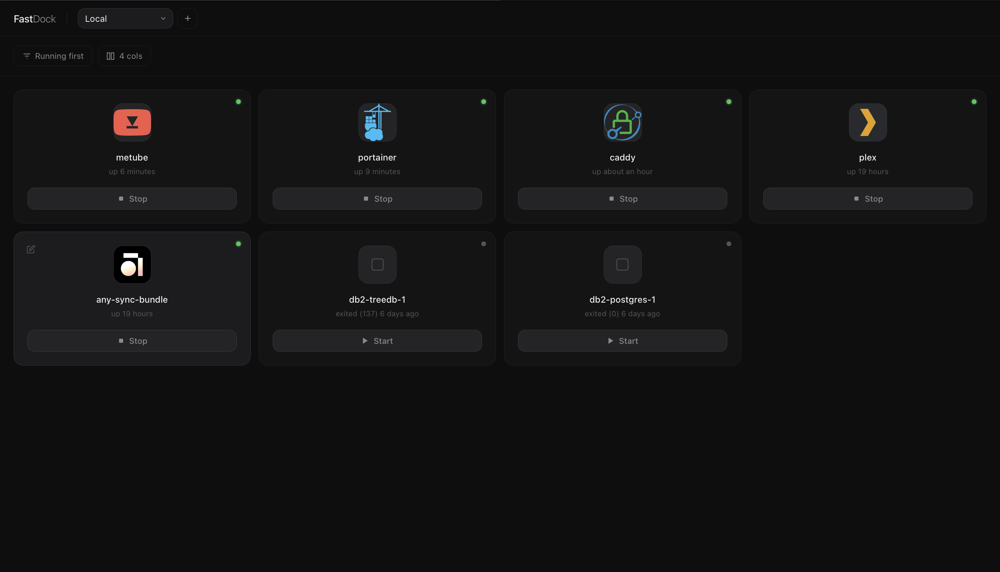
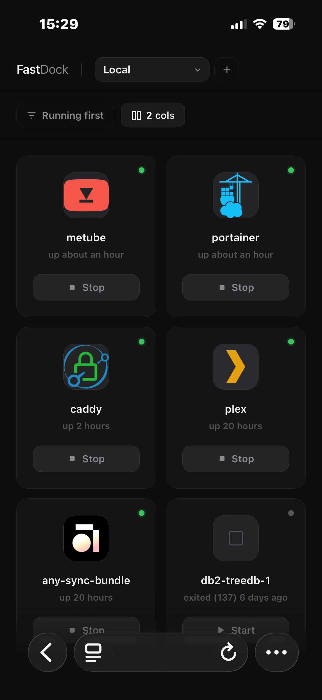
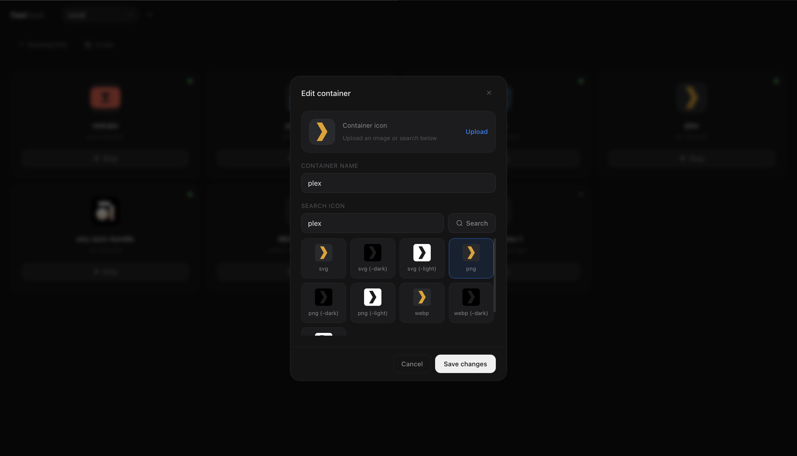

# Fastdock

A simple web-based Docker container management interface with a modern design. This application provides a fast and intuitive way to start and stop Docker containers on the go through a beautiful web interface.

<table>
    <tr>
        <td>
            
        </td>
        <td>
            
        </td>
    </tr>
</table>



## Security Notice

This application is designed for **internal/LAN use only** and should be deployed behind a VPN or in a secure network environment. It has no user authentication — all users on the network have full container management capabilities.

## Features

* **Real-time Container Management**: Start and stop Docker containers
* **Multi-Server Management**: Manage Docker containers across multiple servers from a single interface
* **Server Selector**: Quickly switch between local and remote servers
* **Add/Edit/Delete Servers**: Configure remote servers with custom name, address, and port
* **Server-Aware Display**: Container cards show which server they belong to
* **Custom Container Icons**: Upload custom icons or search from the selfh.st/icons library
* **Container Renaming**: Assign custom names to containers
* **Responsive Design**: Works seamlessly on desktop, tablet, and mobile devices

## Quick Start

### Prerequisites

* Node.js >= 16.0.0
* Docker daemon running
* Docker socket accessible (`/var/run/docker.sock`)

### Installation

1. **Clone the repository**

```bash
git clone https://github.com/totovr46/fastdock.git
cd fastdock
```

2. **Install dependencies**

```bash
npm install
```

3. **Start the application**

```bash
npm start
```

### Development (auto-reload)

```bash
npm run dev
```

This uses Node.js watch mode (`node --watch`) and avoids nodemon configuration conflicts.

If you prefer nodemon:

```bash
npm run dev:nodemon
```

Note: don’t run `npm run dev server.js` — `server.js` is already the entrypoint and extra args may be forwarded.

4. **Access the interface**
   Open your browser and navigate to `http://serverIP:3080`

On first boot, the `data/` directory is created automatically and any existing settings are migrated from `public/` to `data/`. After confirming the app works correctly, you can delete `public/containerSettings.json` and `public/appSettings.json` if they were present.

## Project Structure

```
fastdock/
├── server.js                   # Entry point — middleware wiring and server startup
├── package.json
├── ecosystem.config.js         # PM2 configuration
├── data/                       # Persistent JSON storage (created on first boot)
│   ├── containerSettings.json
│   └── appSettings.json
├── routes/
│   ├── containers.js           # Container list, start/stop, settings, icon upload
│   ├── appSettings.js          # Remote server CRUD
│   └── icons.js                # Icon search and download
├── middleware/
│   ├── upload.js               # File upload handling with MIME validation
│   └── errorHandler.js         # Global error handler
├── utils/
│   └── dataStore.js            # Async JSON read/write with atomic writes
└── public/
    ├── index.html              # Single-page web interface
    └── assets/                 # Uploaded container icons (created on first boot)
```

## API Endpoints

### Container Operations

* `GET /api/containers` — List all containers
* `POST /api/containers/:id/start` — Start a container
* `POST /api/containers/:id/stop` — Stop a container
* `GET /api/containers/name/:name` — Find container by name
* `POST /api/containers/settings/:id` — Update container name and/or icon
* `GET /api/containers/settings` — Get all container customizations

### Server Management

* `GET /api/app-settings` — Get configured remote servers
* `POST /api/app-settings/servers` — Add a new server
* `PUT /api/app-settings/servers/:index` — Edit an existing server
* `DELETE /api/app-settings/servers/:index` — Remove a server

### Icon Management

* `GET /api/search-icon/:name` — Search selfh.st/icons via jsdelivr CDN
* `POST /api/download-icon` — Download and store an icon (CDN only)

## Configuration

### Environment Variables

* `PORT` — Server port (default: `3080`)

### Reverse Proxy

FastDock is often deployed behind a reverse proxy (e.g. Caddy/Nginx). The server enables Express `trust proxy` so rate limiting works correctly when `X-Forwarded-For` is present.

### Docker Socket

The application requires access to the Docker socket:

```bash
ls -la /var/run/docker.sock
```

### PM2 (recommended for production)

```bash
npm install -g pm2
pm2 start ecosystem.config.js
pm2 save
```

## Usage

### Basic Operations

1. **Select Server**: Use the dropdown to choose a local or remote server
2. **View Containers**: See all containers for the selected server
3. **Start/Stop**: Click the button on any container card
4. **Edit Container**: Click the pencil icon to change the name or icon

### Container Customization

1. Click the edit icon on any container card
2. Upload a custom icon (PNG, JPG, GIF, WebP, or SVG — max 2MB)
3. Or search for an icon by name (sourced from selfh.st/icons)
4. Set a custom display name
5. Click "Save"

### Server Management

1. Click "+" next to the server selector to add a remote server
2. Enter a name, address (e.g. `http://192.168.1.5`), and port
3. Use the edit (pencil) or delete (trash) buttons to manage existing servers

### Status Indicators

* Green dot — Container is running
* Red dot — Container is stopped

## Security

The following security measures are implemented:

* **Security headers** via Helmet (X-Frame-Options, X-Content-Type-Options, CSP, etc.)
* **Rate limiting** — 100 API requests/minute per IP; 20 for icon downloads
* **Input validation** — Container IDs, server addresses, port numbers, and filenames are validated server-side
* **File upload validation** — MIME type checked via HTTP header and magic bytes; 2MB size limit; filename sanitized
* **SSRF protection** — Icon downloads are whitelisted to `cdn.jsdelivr.net` only; redirects are blocked
* **Path traversal protection** — All file paths are resolved and checked against the assets directory
* **No internal error details exposed** — Server errors are logged server-side; clients receive generic messages
* **Data files outside web root** — Settings JSON files are stored in `data/` and are not accessible over HTTP

## Limitations

* No user authentication — deploy in a trusted network only
* No audit logging of container operations
* Single instance only

## Contributing

1. Fork the repository
2. Create a feature branch (`git checkout -b feature/amazing-feature`)
3. Commit your changes
4. Push to the branch and open a Pull Request

---

**Important**: This application provides direct access to Docker containers. Deploy only in secure, controlled environments with trusted users.


